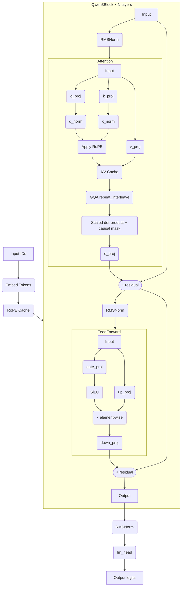

# Qwen3-PyTorch

This repository provides a clean, minimalistic implementation of the Qwen3 large language model in PyTorch. It focuses on clarity and direct implementation of the core architecture, including Grouped Query Attention (GQA) and Rotary Positional Embeddings (RoPE).

## How to Run

To run the main program and generate text with the Qwen3 model, follow these steps:

1.  **Ensure Model Weights:** The `main.py` script expects model weights to be present in `./hf/model.safetensors` or will attempt to download them from Hugging Face if a `model_id` is provided. You can place your `model.safetensors` and `tokenizer.json` files in the `hf/` directory.

2.  **Execute the Script:**
    You can run the script with the default Qwen3-0.6B model:

    ```bash
    python main.py
    ```

    Or, specify a different Qwen3 model ID as a command-line argument:

    ```bash
    python main.py "Qwen/Qwen3-1.8B"
    ```

    The script will load the model, encode a sample prompt, and generate a response.

## Model Architecture (Qwen3)

The Qwen3 model implemented here is built upon a decoder-only transformer architecture. Key components and their interactions are detailed below:

### Core Components

*   **`Qwen3`**: The main model class, orchestrating the entire forward pass. It comprises an embedding layer, a stack of `Qwen3Block`s, a final normalization, and a language modeling head.
*   **`Qwen3Block`**: Represents a single transformer block. Each block includes an Attention mechanism and a Feed-Forward Network, both preceded by RMSNorm layers, and incorporates residual connections.
*   **`Attention`**: Implements the multi-head (or grouped-query) attention mechanism. It uses linear projections for queries, keys, and values, applies Rotary Positional Embeddings (RoPE), and utilizes Grouped Query Attention (GQA) for efficiency. QK normalization is applied per-head.
*   **`FeedForward`**: A standard feed-forward network with three linear layers (`gate`, `up`, `down`) and a SiLU activation function, forming a SwiGLU-like structure.
*   **`RMSNorm`**: A root mean square normalization layer used for stabilizing training, applied before attention and feed-forward networks within each block, and once at the model's output.
*   **Rotary Positional Embeddings (RoPE)**: Applied within the `Attention` mechanism to inject positional information into the query and key vectors.

### Architectural Flow

The model processes input tokens through the following sequence:

1.  **Token Embedding**: Input token IDs are converted into dense vector representations.
2.  **Stacked Decoder Blocks**: The embeddings pass through multiple `Qwen3Block`s. Each block performs:
    *   **Pre-Normalization**: An `RMSNorm` layer.
    *   **Attention**: Computes self-attention over the sequence, incorporating RoPE and GQA.
    *   **Residual Connection**: The attention output is added to the input of the block.
    *   **Pre-Normalization**: Another `RMSNorm` layer.
    *   **Feed-Forward Network**: Processes the features with a non-linear transformation.
    *   **Residual Connection**: The FFN output is added back.
3.  **Final Normalization**: An `RMSNorm` layer is applied to the output of the last decoder block.
4.  **Language Modeling Head**: A linear layer projects the normalized features to the vocabulary size, producing logits for the next token prediction.

## Model Architecture Diagram


